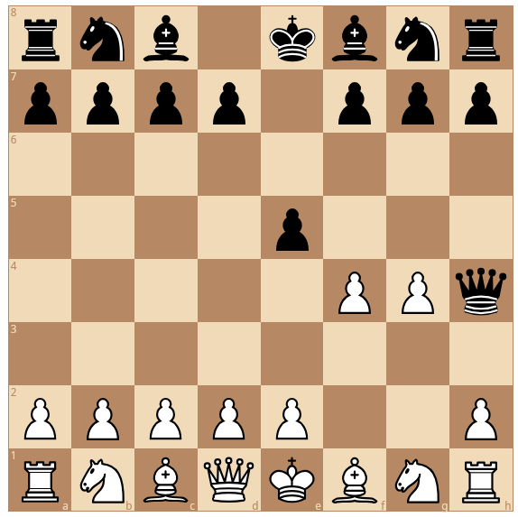

# chess4tcl - Tcl library to work with the chessboard
Tcl library  using the [chess.js](https://github.com/jhlywa/chess.js)
library and the  [tcl-duktape](https://github.com/dbohdan/tcl-duktape) to work
with chess games and chess positions within Tcl.

## Installation

You need the  [tcl-duktape](https://github.com/dbohdan/tcl-duktape)  library  installed to be able to use the Javascript
code.

## Documentation 

- [Manual](https://htmlpreview.github.io/?https://raw.githubusercontent.com/mittelmark/chess4tcl/master/chess4tcl/chess4tcl.html)

## Example

```
package require chess4tcl
set chess [::chess4tcl::Chess4Tcl new]
$chess load "rnb1kbnr/pppp1ppp/8/4p3/5PPq/8/PPPPP2P/RNBQKBNR w KQkq - 1 3"
puts [$chess game_over]
## ==> true
```

To  display a board  within a  Markdown/HTML  document  you can use either the
`svg` or the  `gboard` methods:

```
puts [$chess $gboard]
```



## API

The following methods are available:

- `::chess4tcl::Chess4Tcl new` - create a new command
- `cmd ascii` - return a board representation in ascii
- `cmd board` - return the board using true type font representation
- `cmd clear` - create an empty board
- `cmd fen` - return the current board as [FEN string](https://www.chess.com/terms/fen-chess)
- `cmd game_over` - check if the current position is final
- `cmd gboard` - graphical board display for a browser using [gchessboard](https://github.com/mganjoo/gchessboard)
- `cmd get square` - returns the current piece on the given square
- `cmd goto_half_move HM` - move in current game to the given half move
- `cmd hboard` - board display using pure CSS and HTML with the Merida Chess Font
- `cmd header ARGS` - either sets the given header or returns all header if no
   argument is given
- `cmd history VERBOSE` - returns all move with or without details
- `cmd in_check` - checks if the current side is in check
- `cmd in_checkmate` - checks if the current side is in checkmate
- `cmd in_draw` - checks if the current position is a technical draw
- `cmd in_stalemate` - checks if the current position is a checkmate
- `cmd in_threefold_repetition`  - checks  if the last  moves  resulted  in a
   threefold repetition
- `cmd  insufficient_material`  - checks if the current position is a draw due
  to insufficient material
- `cmd load FEN-STRING` - loads the given FEN string
- `cmd move MOVE` - executes the given move
- `cmd moves` - returns all possible moves in the current position
- `cmd new` - create a new game from the start position
- `cmd load_pgn PGN-STRING` - load a new game from the given PGN string
- `cmd pgn` - return the current game as PGN string
- `cmd put PIECE ?color square?` - place a piece on a possible empty board
- `cmd reset` - Reset the board to the initial starting position
- `cmd remove square` - Remove a piece from a given square
- `cmd svg ARGS` - returns a SVG image of the current board
- `cmd turn` - returns who is in turn on the current board

## Acknowledgments

- [tcl-duktape by D. Bohdan](https://github.com/dbohdan/tcl-duktape)  - Using
  Javascript with Tcl (MIT License)
- [chess.js by Jeff Hlywa](https://github.com/jhlywa/chess.js) -
  TypeScript/Javascript chess library  (BSD 2 License)
- [Chess Merida Unicode by Michaël Peeters](https://github.com/xeyownt/chess_merida_unicode) -  mapping  of  the  Unicode  chess  characters  to the  chess  font  Merida
  (Unlicense License) - inspiring svg method
- [Chess Merida Example using CSS by Manfred Rosenboom"](https://github.com/maroph/chess-merida-webfont) - inspiring hboard method
- [Freeware Chess Merida Font created by Armando Hernandez Marroquin](https://www.enpassant.dk/chess/fonteng.htm#MERIDA)

## Author

@2017-2025 Detlef Groth, University of Potsdam, Germany

## License

MIT


