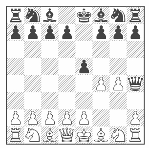

# chess4tcl - Tcl library to work with the chessboard

[](https://opensource.org/license/bsd)
[](https://github.com/mittelmark/chess4tcl/releases)


[](http://htmlpreview.github.io/?https://github.com/mittelmark/chess4tcl/blob/master/chess4tcl/chess4tcl.html)
[](https://wiki.tcl-lang.org/page/Chess4Tcl)

Tcl library  using the [chess.js](https://github.com/jhlywa/chess.js)
library and the  [tcl-duktape](https://github.com/dbohdan/tcl-duktape) to display chess games
and chess positions using Tcl with Tk applications or within reports using Tcl as their report language.

## Documentation 

- [Manual](https://htmlpreview.github.io/?https://raw.githubusercontent.com/mittelmark/chess4tcl/master/chess4tcl/chess4tcl.html)

## Installation

You need the [tcl-duktape](https://github.com/dbohdan/tcl-duktape)  library  installed to be able to use the Javascript
code. Download the package from the latest [Releases](https://github.com/mittelmark/chess4tcl/releases) page. 
There are as well downloads for Linux-intel, MacOS-intel, MacOS-apple and Windows-intel provided with included compilations of the
[tcl-duktape](https://github.com/dbohdan/tcl-duktape) package provided. Use these tcl-duktape package files only if you can't install
this package on your own using your package manager or Tcl installer as these compilations are untested. 
Download and unzip the files then just into a folder belonging to your `auto_path` variable as usually.


## Example

```
package require chess4tcl
set chess [::chess4tcl::Chess4Tcl new]
$chess load "rnb1kbnr/pppp1ppp/8/4p3/5PPq/8/PPPPP2P/RNBQKBNR w KQkq - 1 3"
puts [$chess game_over]
## ==> true
```

To  display a board  within a  Markdown/HTML  document  you can use either the
`svg`, the  `gboard` or the `hboard`  methods.  The gboard  method  embeds the
gchessboard web component and requires an internet  connection to download the
required Javascript code for display. Here the output:

```
puts [$chess gboard]
```


The  `hboard`  method just uses the  embedded  Merida true type chess font and
displays the  chessboard  in the  black/white  style purely CSS driven. As the
font and the style rules are  automatically  included this does not require an
internet connection. Here an example output:

```
puts [$chess hboard]
```



To display a board for instance within a Tk text widget you need to install a chess font like
[Chess Berlin](http://www.enpassant.dk/chess/downl/berlin.zip) or 
[Chess Merida](http://www.enpassant.dk/chess/downl/merid_tt.zip) and then you can do thinks like this:

```
package require Tk
font create chessberlin -family "Chess Berlin" -size 20 
option add *font chessberlin
pack [text .t]
t insert end [$chess board Berlin]
```

The the output in your Tk widget should be the same as in the `$chess hboard` figure.

## API

The following methods are available:

- `::chess4tcl::Chess4Tcl new` - create a new command
- `cmd ascii` - return a board representation in ascii
- `cmd board` - return the board using true type font representations, defaults to Merida
- `cmd clear` - create an empty board
- `cmd fen` - return the current board as [FEN string](https://www.chess.com/terms/fen-chess)
- `cmd game_over` - check if the current position is final
- `cmd gboard` - graphical board display for a browser using [gchessboard](https://github.com/mganjoo/gchessboard)
- `cmd get square` - returns the current piece on the given square
- `cmd goto_half_move HM` - move in current game to the given half move
- `cmd hboard` - board display using pure CSS and HTML with the Merida Chess Font
- `cmd header ARGS` - either sets the given header or returns all header if no
   argument is given
- `cmd history VERBOSE` - returns all move with or without details
- `cmd in_check` - checks if the current side is in check
- `cmd in_checkmate` - checks if the current side is in checkmate
- `cmd in_draw` - checks if the current position is a technical draw
- `cmd in_stalemate` - checks if the current position is a checkmate
- `cmd in_threefold_repetition`  - checks  if the last  moves  resulted  in a
   threefold repetition
- `cmd insufficient_material`  - checks if the current position is a draw due
  to insufficient material
- `cmd load FEN-STRING` - loads the given FEN string
- `cmd move MOVE` - executes the given move
- `cmd moves` - returns all possible moves in the current position
- `cmd new` - create a new game from the start position
- `cmd load_pgn PGN-STRING` - load a new game from the given PGN string
- `cmd pgn` - return the current game as PGN string
- `cmd put PIECE ?color square?` - place a piece on a possible empty board
- `cmd reset` - Reset the board to the initial starting position
- `cmd remove square` - Remove a piece from a given square
- `cmd svg ARGS` - returns a SVG image of the current board
- `cmd turn` - returns who is in turn on the current board

## Command line application

The package is as well a standalone command line application which can be used
to  convert  FEN  strings  into SVG, RTF or HTML  output.  If the  package  is
properly          installed          you          can          use         the
[tclmain](https://github.com/mittelmark/tclmain)    application    to   do   a
conversion like this:

```bash
$ tclmain -m chess4tcl --version
0.1.0
$ tclmain -m chess4tcl --help
 chess4tcl - Tcl application to display chessboard postions
            @ Detlef Groth, University of Potsdam, Germany

 Usage: tclmain -m chess4tcl ?-h ,--help, --format FORMAT? FENSTRING ?OUTFILE?

 Options:

    --format   FORMAT - output format, either svg (default), ascii, css, html or rtf

 Arguments:

   FENSTRING        - FEN string encoded chess position
   OUTFILE          - file to write the position into
                     if not given or a - (minus) uses stdout

$ tclmain -m chess4tcl --format ascii "rnb1kbnr/pppp1ppp/8/4p3/5PPq/8/PPPPP2P/RNBQKBNR w KQkq - 1 3"
chess4tcl - Tcl application to display chessboard postions
            @ Detlef Groth, University of Potsdam, Germany

 Usage: tclmain -m chess4tcl ?-h ,--help, --format FORMAT? FENSTRING ?OUTFILE?

 Options:

    --format   FORMAT - output format, either svg (default), ascii, css, html or rtf

 Arguments:

   FENSTRING        - FEN string encoded chess position
   OUTFILE          - file to write the position into
                     if not given or a - (minus) uses stdout
        append res "\n"
$ tclmain -m chess4tcl --format ascii "rnb1kbnr/pppp1ppp/8/4p3/5PPq/8/PPPPP2P/RNBQKBNR w KQkq - 1 3"
   +------------------------+
 8 | r  n  b  .  k  b  n  r |
 7 | p  p  p  p  .  p  p  p |
 6 | .  .  .  .  .  .  .  . |
 5 | .  .  .  .  p  .  .  . |
 4 | .  .  .  .  .  P  P  q |
 3 | .  .  .  .  .  .  .  . |
 2 | P  P  P  P  P  .  .  P |
 1 | R  N  B  Q  K  B  N  R |
   +------------------------+
     a  b  c  d  e  f  g  h        
$ tclmain -m chess4tcl --format html "rnb1kbnr/pppp1ppp/8/4p3/5PPq/8/PPPPP2P/RNBQKBNR w KQkq - 1 3"
<script type="module" src="https://unpkg.com/gchessboard"></script>
<div style="max-width: 400px;margin-left:35px;">
  <g-chess-board fen="rnb1kbnr/pppp1ppp/8/4p3/5PPq/8/PPPPP2P/RNBQKBNR" style="--square-color-dark: hsl(27deg, 36%, 55%);--square-color-light: hsl(37deg, 66%, 83%);"></g-chess-board>
```


## Acknowledgments

- [tcl-duktape by D. Bohdan](https://github.com/dbohdan/tcl-duktape)  - Using Javascript with Tcl (MIT License)
- [chess.js by Jeff Hlywa](https://github.com/jhlywa/chess.js) -  TypeScript/Javascript chess library  (BSD 2 License)
- [Chess Merida Unicode by Michaël Peeters](https://github.com/xeyownt/chess_merida_unicode) -  mapping  of  the
  Unicode  chess  characters  to the  chess  font  Merida  (Unlicense License) - inspiring svg method
- [Chess Merida Example using CSS by Manfred Rosenboom"](https://github.com/maroph/chess-merida-webfont) - inspiring hboard method
- [Freeware Chess Merida Font created by Armando Hernandez Marroquin](https://www.enpassant.dk/chess/fonteng.htm#MERIDA)

## Author

@2017-2025 Detlef Groth, University of Potsdam, Germany

## License

MIT


